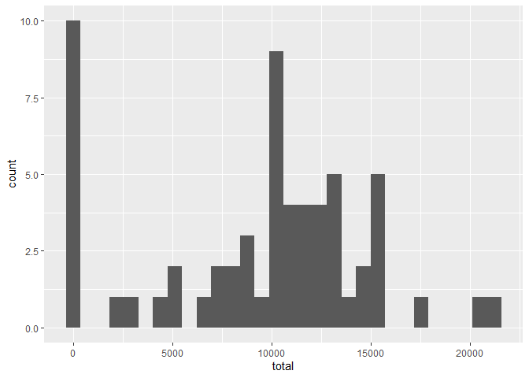
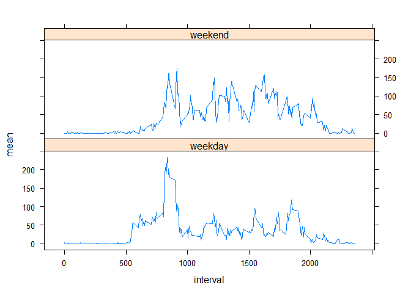

## Loading and preprocessing the data


```r
unzip("activity.zip")
dat<-read.csv("activity.csv")
dat$date<-as.Date.character(dat$date,format = c("%Y-%m-%d"))
```

## What is mean total number of steps taken per day?


```r
library(dplyr)
library(ggplot2)
```

```
## Warning: package 'ggplot2' was built under R version 4.0.3
```

```r
#total number of steps taken per day
  tot<-group_by(dat,date)
  tot<-summarise(tot,total=sum(steps,na.rm=TRUE))
  head(tot)
```

```
## # A tibble: 6 x 2
##   date       total
##   <date>     <int>
## 1 2012-10-01     0
## 2 2012-10-02   126
## 3 2012-10-03 11352
## 4 2012-10-04 12116
## 5 2012-10-05 13294
## 6 2012-10-06 15420
```

```r
library(ggplot2)
#histogram of the total number of steps taken each day
  g1<-ggplot(tot,aes(x=total))
  g1+geom_histogram()
```

<!-- -->

```r
#mean and median of the total number of steps taken per day
  mean(tot$total)
```

```
## [1] 9354.23
```

```r
  median(tot$total)
```

```
## [1] 10395
```

## What is the average daily activity pattern?


```r
#total number of steps taken per day
  tot_inter<-group_by(dat,interval)
  tot_inter<-summarise(tot_inter,mean=mean(steps,na.rm=TRUE))
 plot(tot_inter$interval,tot_inter$mean,type="l",xlab = "interval",ylab="mean")
```

<!-- -->

```r
 m<-subset(tot_inter,mean==max(mean))
```
the interval containing the maximum number of steps is 835


## Imputing missing values
The total number of missing values in the dataset is 2304


to complete the missing data we will use the mean of each interval


```r
dat_2<-dat
for (i in 1:length(dat$steps)) {
  if (is.na(dat$steps[i]))
  {
    dat_2$steps[i]<-as.numeric(tot_inter[tot_inter$interval==dat$interval[i],"mean"])
  }
}
```
ahora veamos el histograma del número total de pasos dados cada día con el nuevo conjunto de datos, sin valores perdidos


```r
tot_2<-group_by(dat_2,date)
tot_2<-summarise(tot_2,total=sum(steps,na.rm=TRUE))
g2<-ggplot(tot_2,aes(x=total))
g2+geom_histogram()
```

<!-- -->

we can see an impact in the days with 0 steps traveled, before the new dataset the frequency was higher

## Are there differences in activity patterns between weekdays and weekends?

```r
library(lattice)
level<-c()
for(i in 1:length(dat$date)){
  if(weekdays(dat$date[i])=="sábado" |weekdays(dat$date[i])=="domingo"){
    level<- c(level,"weekend")}
  else {
    level<- c(level,"weekday")}
}
dat_3<-cbind.data.frame(dat,level)
dat_3$level<-as.factor(dat_3$level)
tot_inter_2<-group_by(dat_3,level,interval)
tot_inter_2<-summarise(tot_inter_2,mean=mean(steps,na.rm=TRUE))
xyplot(mean~interval|level,data=tot_inter_2,layout=c(1,2),type="l")
```

<!-- -->


we can see that the means in the steps in weekends are greater than the means in the steps in weekdays 
